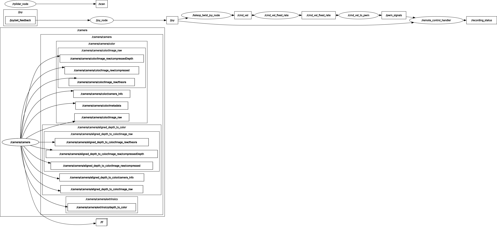
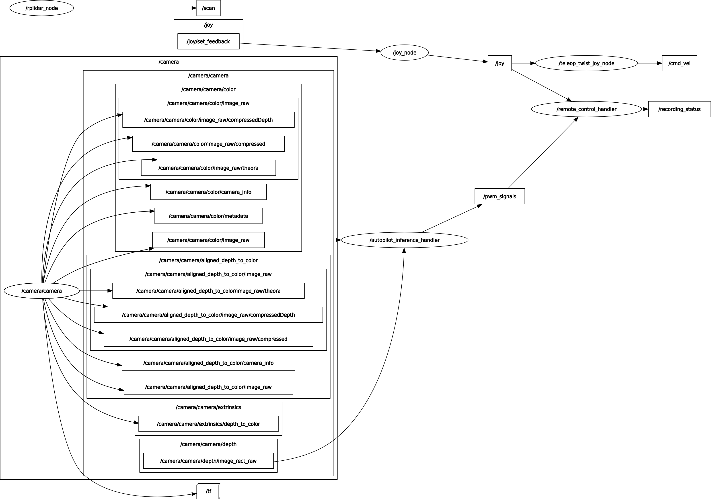
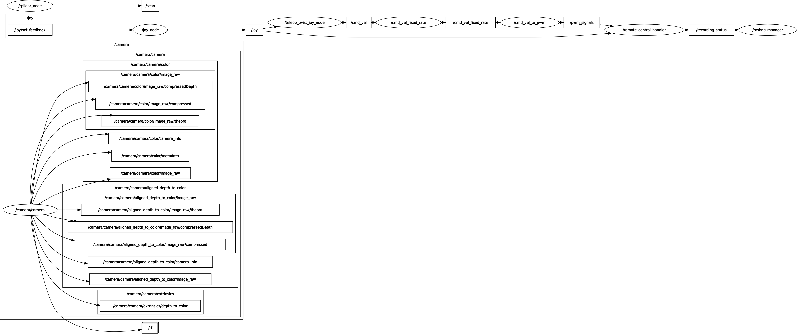

# Node Communication in ROS2 Jeteja 

Below are the images of the node communication when running typical Jeteja ROS2 packages using *rqt_graph*. 

RQT graph when running the jeteja_launch package in manual mode

RQT graph when running the jeteja_launch package in autopilot mode

RQT graph when running the jeteja_record package while the robot
is running in manual mode

